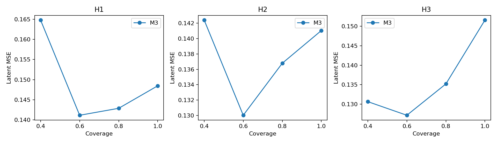

# Ensemble Reliability and Size Analysis: step1_reliability

Seeds: 42, 43, 44. M1/M3 re-evaluate existing A/C checkpoints; M2/M5 are newly trained.

Errors are measured per test trajectory-window and horizon. Values are seed means;
± denotes sample standard deviation across the three seeds. H3 MSE standard deviation is the stability measure.

## Prediction performance

| Model | H1 MSE | H2 MSE | H3 MSE | H1 Cosine | H2 Cosine | H3 Cosine |
|---|---:|---:|---:|---:|---:|---:|
| M1 | 0.1599 ± 0.0113 | 0.1540 ± 0.0198 | 0.1593 ± 0.0325 | 0.9167 ± 0.0060 | 0.9199 ± 0.0104 | 0.9173 ± 0.0170 |
| M3 | 0.1485 ± 0.0037 | 0.1410 ± 0.0077 | 0.1516 ± 0.0184 | 0.9228 ± 0.0020 | 0.9267 ± 0.0040 | 0.9212 ± 0.0096 |

## Uncertainty–latent-error correlation

Correlations are computed within each seed against L2 error, then averaged.
Survival disagreement is an auxiliary latent-error signal, not a survival correctness/calibration metric.

| Model | Horizon | Uz Pearson | Uz Spearman | Us Pearson | Us Spearman |
|---|---|---:|---:|---:|---:|
| M1 | H1 | — | — | — | — |
| M1 | H2 | — | — | — | — |
| M1 | H3 | — | — | — | — |
| M3 | H1 | -0.2432 | 0.0814 | 0.2058 | 0.0922 |
| M3 | H2 | 0.0154 | 0.0186 | 0.0423 | 0.1853 |
| M3 | H3 | 0.4744 | 0.3373 | 0.0107 | -0.0637 |

M1 has constant zero disagreement: correlations are undefined and it has no uncertainty-based coverage curve.

## Four-point risk–coverage

Lowest-Uz windows are retained, using ceil(coverage × N) and stable ordering for ties.

| Model | Coverage | Retained windows / seed | H1 MSE | H2 MSE | H3 MSE |
|---|---:|---:|---:|---:|---:|
| M3 | 100% | 16 | 0.1485 | 0.1410 | 0.1516 |
| M3 | 80% | 13 | 0.1429 | 0.1368 | 0.1352 |
| M3 | 60% | 10 | 0.1412 | 0.1300 | 0.1271 |
| M3 | 40% | 7 | 0.1648 | 0.1424 | 0.1306 |

Member MSE/Cosine, raw-prediction pairwise Pearson correlations, and averaging gains are in [summary.json](summary.json).

Latent-space comparisons retain the original jointly trained encoder setup; different model encoders can differ in scale.

## Figures

