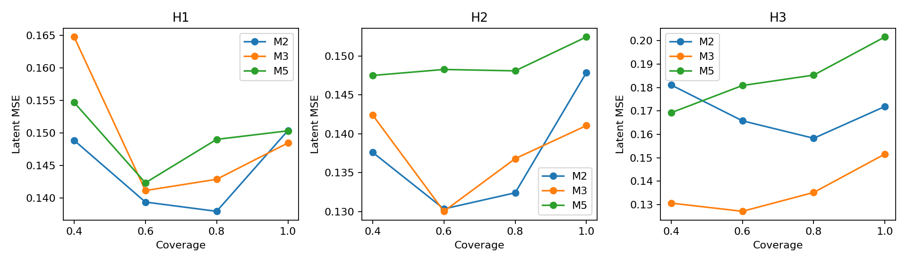
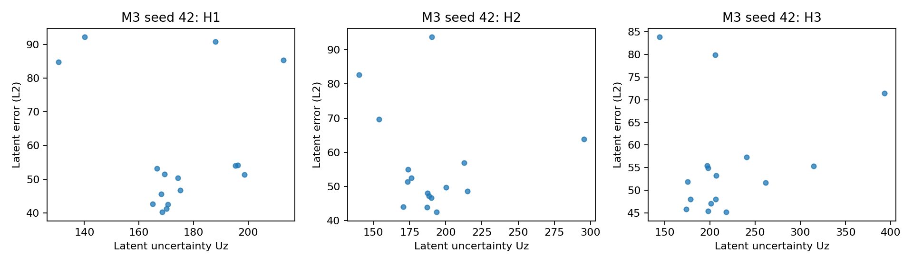
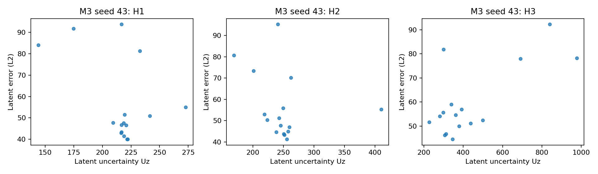
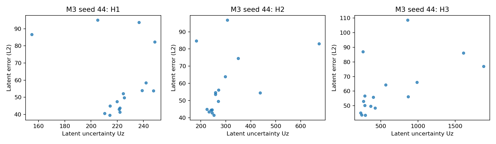

# Ensemble Reliability and Size Analysis: step2_size

Seeds: 42, 43, 44. M1/M3 re-evaluate existing A/C checkpoints; M2/M5 are newly trained.

Errors are measured per test trajectory-window and horizon. Values are seed means;
± denotes sample standard deviation across the three seeds. H3 MSE standard deviation is the stability measure.

## Prediction performance

| Model | H1 MSE | H2 MSE | H3 MSE | H1 Cosine | H2 Cosine | H3 Cosine |
|---|---:|---:|---:|---:|---:|---:|
| M1 | 0.1599 ± 0.0113 | 0.1540 ± 0.0198 | 0.1593 ± 0.0325 | 0.9167 ± 0.0060 | 0.9199 ± 0.0104 | 0.9173 ± 0.0170 |
| M2 | 0.1504 ± 0.0100 | 0.1479 ± 0.0233 | 0.1719 ± 0.0563 | 0.9218 ± 0.0052 | 0.9231 ± 0.0121 | 0.9106 ± 0.0290 |
| M3 | 0.1485 ± 0.0037 | 0.1410 ± 0.0077 | 0.1516 ± 0.0184 | 0.9228 ± 0.0020 | 0.9267 ± 0.0040 | 0.9212 ± 0.0096 |
| M5 | 0.1503 ± 0.0052 | 0.1524 ± 0.0171 | 0.2016 ± 0.0534 | 0.9216 ± 0.0028 | 0.9205 ± 0.0092 | 0.8946 ± 0.0282 |

## Uncertainty–latent-error correlation

Correlations are computed within each seed against L2 error, then averaged.
Survival disagreement is an auxiliary latent-error signal, not a survival correctness/calibration metric.

| Model | Horizon | Uz Pearson | Uz Spearman | Us Pearson | Us Spearman |
|---|---|---:|---:|---:|---:|
| M1 | H1 | — | — | — | — |
| M1 | H2 | — | — | — | — |
| M1 | H3 | — | — | — | — |
| M2 | H1 | -0.1316 | 0.2471 | -0.0107 | -0.0990 |
| M2 | H2 | 0.0893 | 0.1853 | 0.1919 | -0.0108 |
| M2 | H3 | 0.2372 | 0.1176 | 0.3120 | 0.0892 |
| M3 | H1 | -0.2432 | 0.0814 | 0.2058 | 0.0922 |
| M3 | H2 | 0.0154 | 0.0186 | 0.0423 | 0.1853 |
| M3 | H3 | 0.4744 | 0.3373 | 0.0107 | -0.0637 |
| M5 | H1 | -0.4066 | 0.1569 | 0.4459 | 0.2235 |
| M5 | H2 | -0.1224 | 0.1265 | 0.2047 | 0.0912 |
| M5 | H3 | 0.4896 | 0.4422 | 0.1194 | 0.1167 |

M1 has constant zero disagreement: correlations are undefined and it has no uncertainty-based coverage curve.

## Four-point risk–coverage

Lowest-Uz windows are retained, using ceil(coverage × N) and stable ordering for ties.

| Model | Coverage | Retained windows / seed | H1 MSE | H2 MSE | H3 MSE |
|---|---:|---:|---:|---:|---:|
| M2 | 100% | 16 | 0.1504 | 0.1479 | 0.1719 |
| M2 | 80% | 13 | 0.1380 | 0.1324 | 0.1583 |
| M2 | 60% | 10 | 0.1394 | 0.1303 | 0.1658 |
| M2 | 40% | 7 | 0.1489 | 0.1376 | 0.1811 |
| M3 | 100% | 16 | 0.1485 | 0.1410 | 0.1516 |
| M3 | 80% | 13 | 0.1429 | 0.1368 | 0.1352 |
| M3 | 60% | 10 | 0.1412 | 0.1300 | 0.1271 |
| M3 | 40% | 7 | 0.1648 | 0.1424 | 0.1306 |
| M5 | 100% | 16 | 0.1503 | 0.1524 | 0.2016 |
| M5 | 80% | 13 | 0.1490 | 0.1481 | 0.1853 |
| M5 | 60% | 10 | 0.1423 | 0.1483 | 0.1809 |
| M5 | 40% | 7 | 0.1547 | 0.1475 | 0.1692 |

Member MSE/Cosine, raw-prediction pairwise Pearson correlations, and averaging gains are in [summary.json](summary.json).

Latent-space comparisons retain the original jointly trained encoder setup; different model encoders can differ in scale.

## Figures

