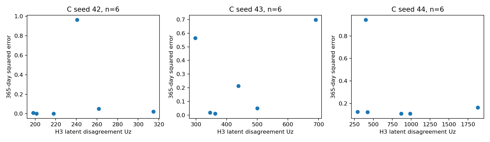

# A vs C: End-to-End Outcome Transfer

Seed-matched 42/43/44; mean ± sample SD across seeds. Descriptive analysis only.

## Latent MSE (all trajectory windows)

|Model|H1|H2|H3|
|---|---:|---:|---:|
|A|0.1599 ± 0.0113|0.1540 ± 0.0198|0.1593 ± 0.0325|
|C|0.1485 ± 0.0037|0.1410 ± 0.0077|0.1516 ± 0.0184|

## H3 survival inputs

True latent is a checkpoint-specific observed-state reference, not a guaranteed performance upper bound.
A and C have separately trained encoders/heads: no cross-model latent swapping.
C predicted = average of member risks/probabilities. C mean latent is an auxiliary fusion control.

|Head/model|Input|C-index ↑|IPCW Brier365 ↓|
|---|---|---:|---:|
|A|true_latent|0.4000 ± 0.1764|0.2346 ± 0.0157|
|A|predicted_latent|0.3778 ± 0.1018|0.3902 ± 0.2831|
|C|true_latent|0.5333 ± 0.1155|0.2501 ± 0.0190|
|C|predicted_latent|0.5111 ± 0.2143|0.3663 ± 0.0738|
|C|mean_predicted_latent|0.5556 ± 0.1388|0.4266 ± 0.1337|

## Within-head predicted minus true

|Model|Δ C-index|Δ Brier365|
|---|---:|---:|
|A|-0.0222 ± 0.1388|0.1556 ± 0.2689|
|C|-0.0222 ± 0.1018|0.1161 ± 0.0880|

## Seed-matched C minus A (native deployment)

|Seed|Δ H1 MSE|Δ H2 MSE|Δ H3 MSE|Δ H3 C-index|Δ H3 Brier365|
|---|---:|---:|---:|---:|---:|
|42|-0.0162|-0.0282|-0.0507|0.2000|-0.4358|
|43|-0.0026|0.0062|0.0302|0.2000|0.1796|
|44|-0.0154|-0.0168|-0.0025|0.0000|0.1844|

## Patient-paired errors

[Full patient × seed paired errors](patient_paired_errors.csv). Each patient's latent MSE is averaged over their windows.
Survival uses only the earliest eligible window. Negative C−A errors favor C; C-index is a cohort metric, not a patient error.
Unknown 365-day outcomes have blank squared errors and zero IPCW contribution; zero is not evidence of correct prediction.

## C disagreement versus survival prediction error

Error = (predicted survival365 − observed alive365)² among known outcomes only, separately within each seed.
Uz = sum of population latent variances; Us = population variance of member survival probabilities.

|Seed|Known patients|Uz Pearson|Uz Spearman|Us Pearson|Us Spearman|
|---|---:|---:|---:|---:|---:|
|42|6|0.0452|0.5429|-0.2466|0.6571|
|43|6|0.4484|0.3143|-0.3120|-0.0286|
|44|6|-0.2988|-0.2571|-0.7502|-0.7714|

## Interpretation limits

365 days is measured from the H3 endpoint, using the existing endpoint survival labels and treatment-prefix conditions.
This is retrospective conditional outcome transfer, not a new baseline-only survival forecasting protocol.
IPCW uses only training patients at the same H3 landmark. Censored-by-365 patients are excluded from error correlations.
A/C latent MSEs use their own fine-tuned encoder coordinates; within-head true-versus-predicted gaps diagnose transfer.
A and C also have different trained heads; cross-model changes are end-to-end effects, not isolated dynamics causality.
Only eight test patients and three training seeds; seeds are not independent patient cohorts. No significance claims.
